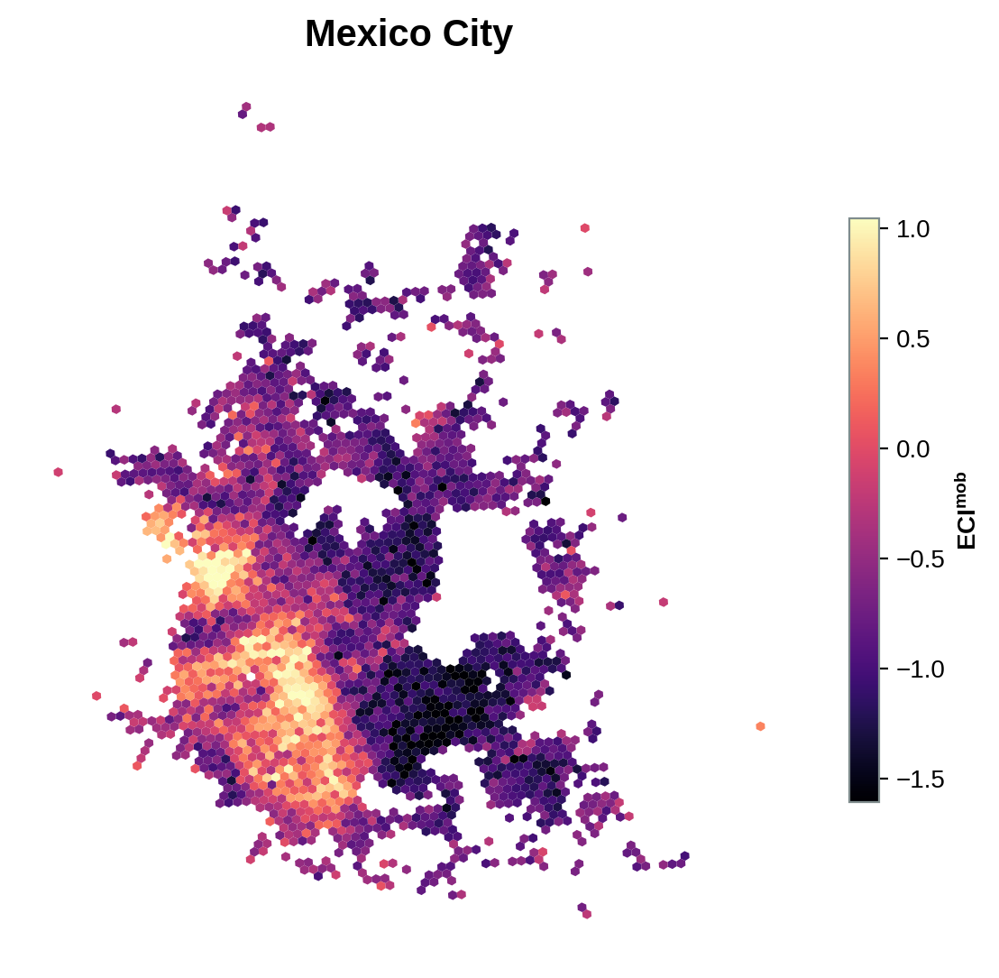
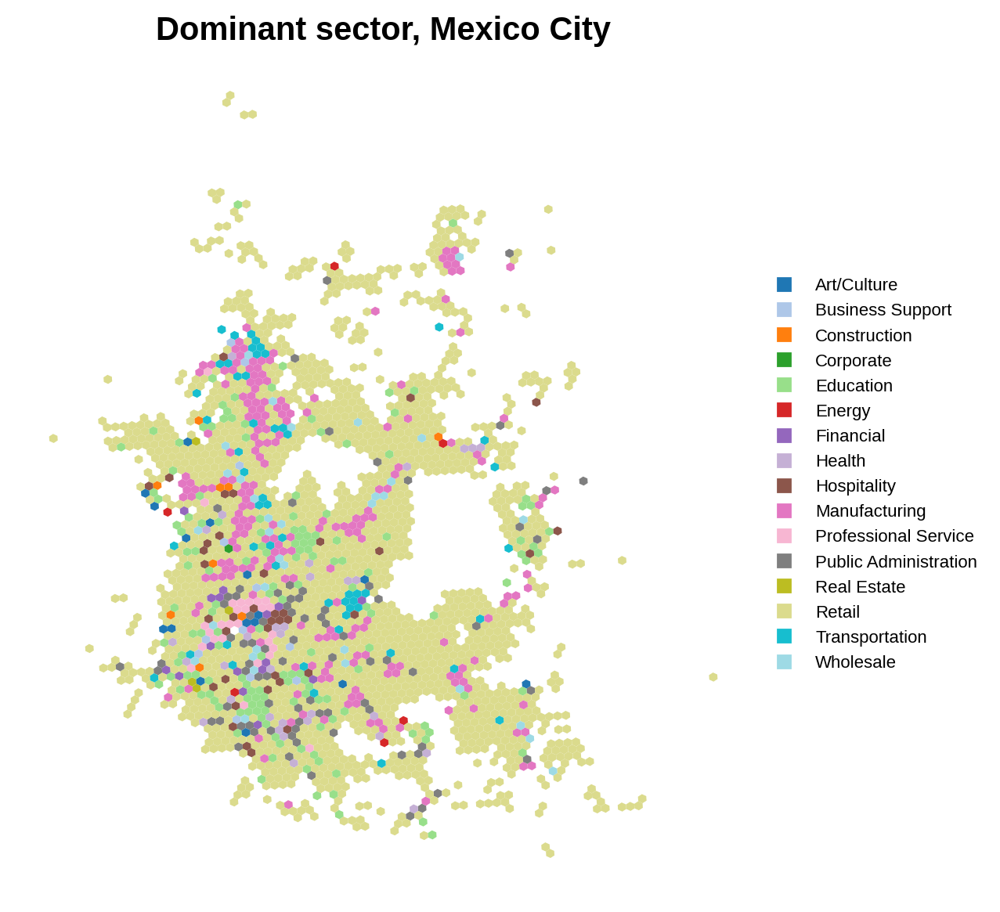
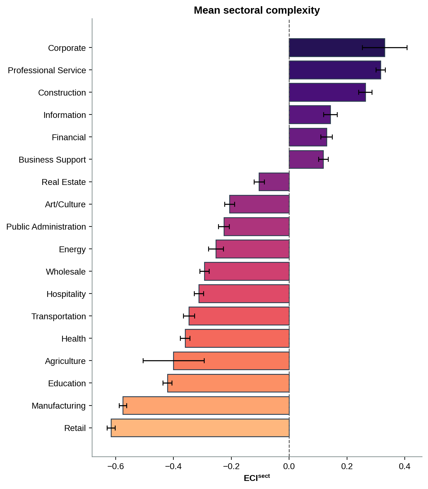
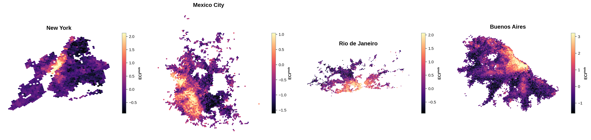
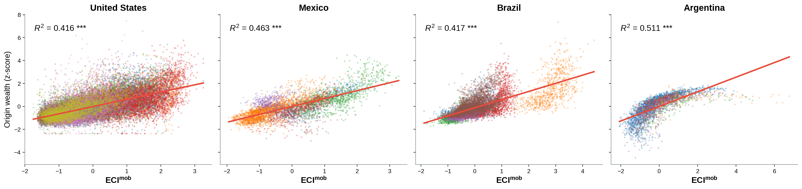
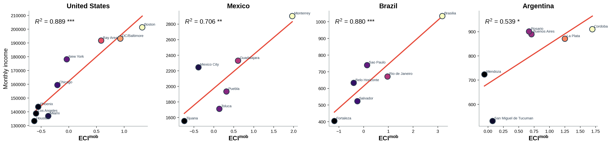
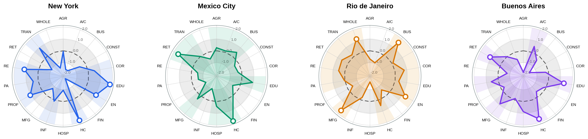
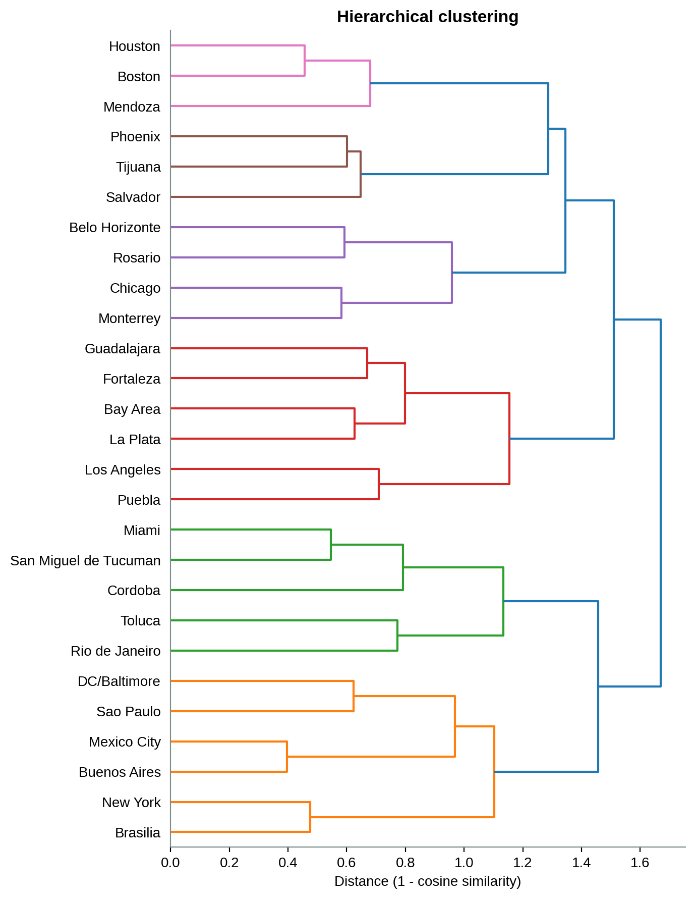
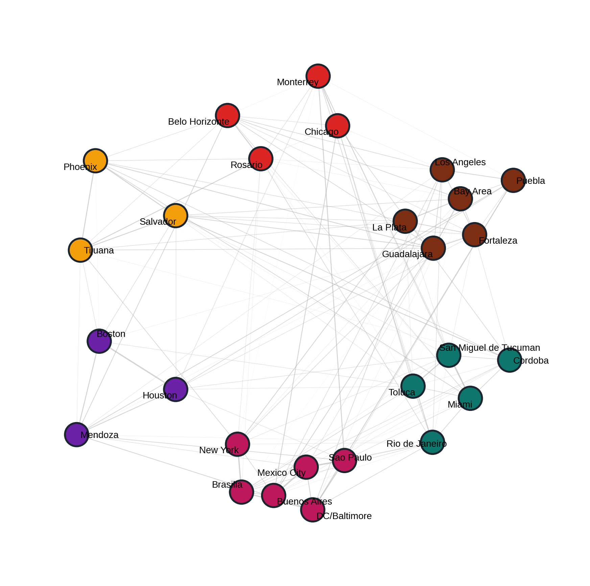
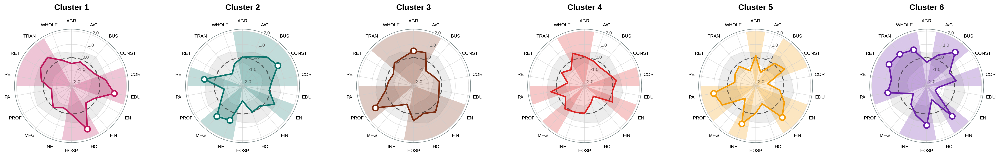

# Mapping the Economic Complexity and Functional Specialization of Cities Using Human Mobility

## Abstract

Cities are multi-scale complex systems in which aggregate economic outcomes emerge from the daily decisions of individuals who combine their skills with the opportunities that the built environment makes reachable. While economic complexity explains national wealth disparities, standard formulations treat cities as single units, leaving internal labor markets unresolved. Here, we measure economic complexity within cities using commuting flows and residential education data across 27 metropolitan areas in the United States, Mexico, Brazil, and Argentina. This approach lets sectoral complexity vary by city, revealing local specializations that country-level frameworks cannot. Crucially, worker-weighted complexity correlates more strongly with metropolitan income than residential education alone, showing that human capital translates to prosperity only when workers can reach demanding jobs. Sectoral rankings reveal international functional clusters, grouping administrative capitals by shared structural signatures. This dynamic framework complements static censuses, helping planners identify capability gaps, diagnose accessibility, and connect underserved communities to economic opportunity.

## Overview

This repository contains the data and analysis for the paper. We build a within-city economic complexity index from human mobility, treating every work location as a bundle of the origins that supply its workforce, summarised by the residential education of those origins. A location is complex when it draws selectively from the higher-education tail rather than from the whole distribution. We then validate the index against income and wealth, project it onto sectors, and group cities by the shape of their sector profile.

The published input is the aggregated origin-destination panel: for each work location, the share of its workers coming from each percentile bin of residential education rate. Work locations are H3 resolution-8 cells, so map geometry comes straight from the cell index. The upstream steps that turn raw mobility traces and census education into this panel are not part of this repository.

## Study Area

27 metropolitan areas across four countries:

- United States: Bay Area, New York, Los Angeles, Chicago, Houston, Phoenix, Boston, Miami, DC/Baltimore.
- Mexico: Mexico City, Guadalajara, Monterrey, Puebla, Toluca, Tijuana.
- Brazil: Sao Paulo, Rio de Janeiro, Salvador, Brasilia, Fortaleza, Belo Horizonte.
- Argentina: Buenos Aires, Cordoba, La Plata, Mendoza, Rosario, San Miguel de Tucuman.

Complexity is estimated once per country over its pooled metros, so values compare across cities within a country but not across countries.

## Requirements

- Python 3.9+
- See `requirements.txt` for package dependencies

Each notebook lives in `src/` and imports the helper modules beside it. Render from that folder, for example `cd src && quarto render city_clustering.qmd`.

## Key Results

### The pipeline in one city

Mexico City makes the whole construction legible. We rebuild location complexity from the commuting panel, map it over the metro, read the dominant sector in each work cell, and project complexity onto sectors.

Complexity peaks along the Reforma and Polanco corridor and the western business districts, and falls off toward the eastern and northern periphery.

Retail blankets the residential periphery, manufacturing follows the industrial corridors, and the complex core carries the service and administrative sectors.

Projecting complexity onto sectors, weighting each work cell by the workers a sector employs there, ranks corporate, professional services and construction at the top and retail, manufacturing and education at the bottom.

### Complexity across the city

The index is defined on work locations and mapped straight from the H3 cell index. Complexity concentrates in and around the central business core and thins toward the edges, with secondary peaks at sub-centres. Some metros read as monocentric, others as polycentric.

### Complexity tracks residential wealth at the sub-city scale

For each work cell we take its origin wealth at destination, the commuting-weighted average of an independent residential wealth proxy over the home zones that feed it. More complex destinations draw their workers from wealthier neighbourhoods, positive and highly significant in all four countries across thousands of cells rather than a handful of aggregates.

### Complexity tracks income better than education at the metropolitan scale

A city's worker-weighted mean complexity is strongly associated with its income, and more so than residential education alone. The gap is sharpest in Mexico, where education is essentially flat against income while complexity is not. Income is in the units each national source reports natively, per capita for Argentina and Brazil, per household for the United States and Mexico.

### The complexity matrix is nested

The work location by education quantile matrix is significantly more nested than a fill-matched null in every country. Complex destinations recruit across the whole education range; simpler ones draw from a narrowing subset near their own level. This is the structure that lets a single axis summarise each location.

### Cities specialise differently in what they do

Projecting complexity onto sectors gives each sector a within-city complexity. Cities of similar overall complexity still differ in their mix, read here against the country mean and its one standard deviation band: professional services, corporate and business support rank high, retail and manufacturing low.

### Cities group by what they specialise in, across borders

Grouping cities on the shape of their sector profile, taken within country so the comparison is about mix rather than level, produces international clusters. Capital and finance hubs cluster together across countries, as do industrial belts and administrative centres, regardless of which country a city belongs to.

