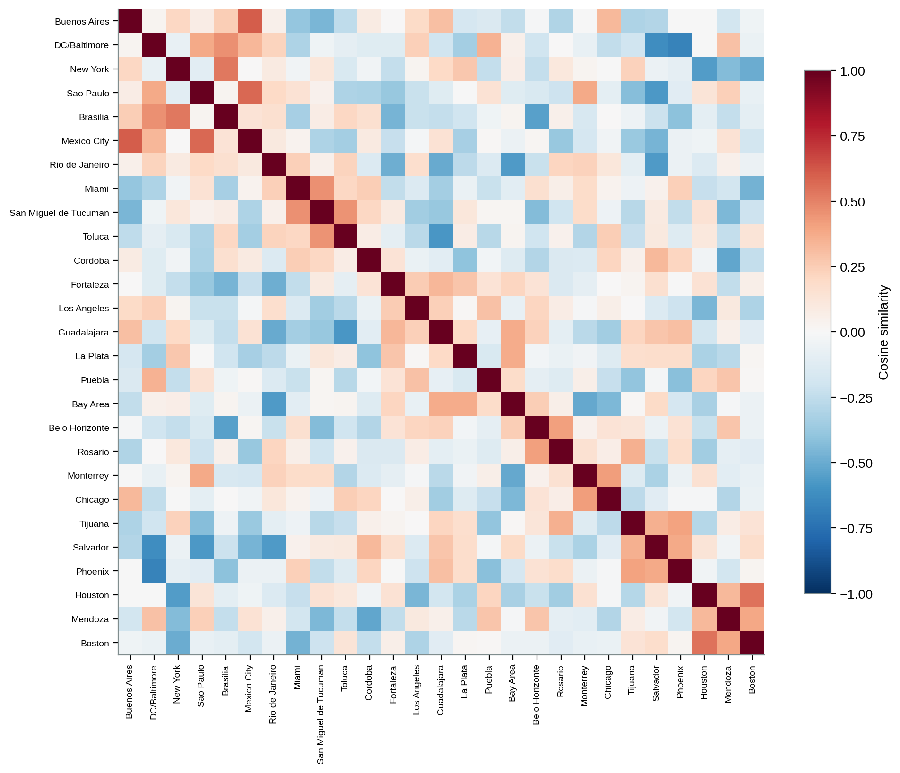

## Setup

Each city is a vector of sector complexity z-scores, taken within its country so the
comparison is about shape rather than level. Cosine similarity on those profiles groups
metros that specialise alike, regardless of country, and the same similarity draws the
network of who resembles whom.

```{python}
import os, sys
os.chdir("..")
sys.path.insert(0, "src")

import pandas as pd

from data import load_rank_zscore, wide_profiles
from clustering import similarity, clusters, cluster_profiles
from figures import style, cosine_heatmap

style()

rank_zscore = load_rank_zscore()
profiles = wide_profiles(rank_zscore)
labels, sim = similarity(profiles)
cl = clusters(sim, k=6)
cl.to_frame("cluster").join(
    rank_zscore.drop_duplicates("city").set_index("city")["country"]).sort_values("cluster")
```

## Who resembles whom

```{python}
cosine_heatmap(sim, cl, "cosine_similarity")
```



Ordering the cities by cluster brings the blocks of mutually similar metros onto the
diagonal.

## Hierarchical clustering


Six groups emerge, mixing countries: capital and finance hubs cluster together across
borders, as do industrial belts and administrative centres.

## Similarity network


## What each group looks like

```{python}
cluster_profiles(rank_zscore, cl).pivot(index="cluster", columns="sector",
                                         values="mean_z").round(2)
```


The cluster profiles name the groups: one leans on finance and corporate services,
another on manufacturing and logistics, another on public administration. Cities land in
a group by what they specialise in, not by which country they belong to.
