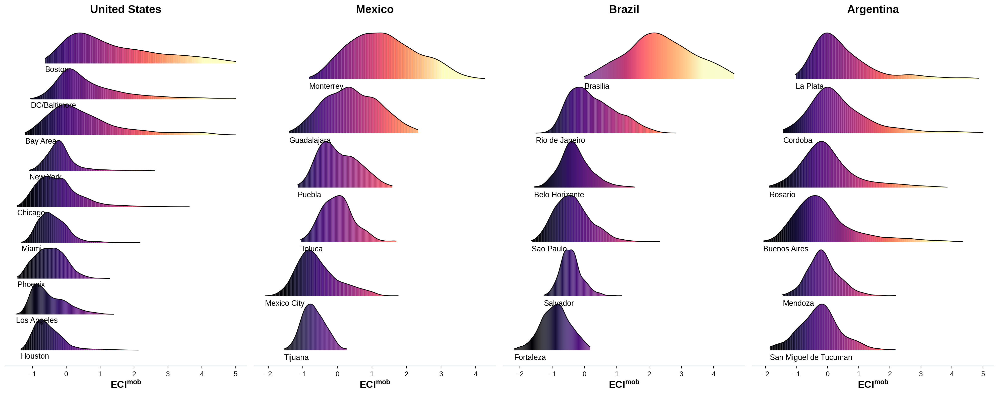

## Setup

We treat each work location as a bundle of the origins that supply its workforce,
summarised by the residential education of those origins. A location is complex
when it draws selectively from the higher-education tail rather than from the whole
distribution. The published input is the aggregated origin-destination panel: for
every work location, the share of its workers coming from each percentile bin of
residential education rate. Work locations are H3 resolution-8 cells; the upstream
steps that turn raw mobility traces and census education into this panel are not
part of this repository.

```{python}
import os, sys
os.chdir("..")
sys.path.insert(0, "src")

import numpy as np
import pandas as pd

from eci import load_panel, location_eci, city_eci, all_locations, COUNTRIES, COUNTRY_NAME
from data import CITY_LABEL
from figures import style, ridge

style()

panel = load_panel("MX")
panel.head()
```

Each country is a pooled panel over its metros. Complexity is estimated once per
country, so values are comparable across cities within a country but not across
countries.

## Location complexity

```{python}
eci = all_locations()
eci.groupby("country")["eci"].describe().round(2)
```

The index spreads work locations along a single axis. Central business districts and
knowledge hubs sit at the top, dormitory and industrial peripheries at the bottom.

## City complexity

A city's complexity is the worker-weighted mean over its work locations.

```{python}
rows = []
for c in COUNTRIES:
    p = load_panel(c)
    e = location_eci(p)
    ce = city_eci(e, p)
    ce["country"] = c
    rows.append(ce)
cities = pd.concat(rows, ignore_index=True)
cities["label"] = cities["city"].map(CITY_LABEL)
cities[["country", "label", "mean_eci", "se_mean_eci", "n"]].round(3)
```

Brasilia and Buenos Aires anchor the high-complexity end of their countries, Salvador,
Fortaleza and Tucuman the low end. The ordering is stable and lines up with what each
metro is known for.

## Distributions by city

```{python}
ridge(eci, "eci_distributions")
```



The distributions widen with the size and functional diversity of the metro. The
largest cities carry a long complex tail; smaller ones concentrate near their country
mean.
