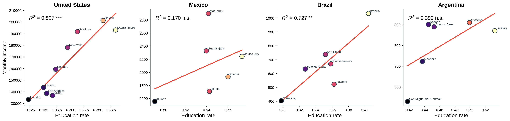

## Setup

We validate the index against economic outcomes at the two scales where it can be
observed: the work location within a city, and the metro as a whole. The wealth proxy
that enters the sub-city test is built from residential census signals independent of
the education signal in the index, so the association does not arise by construction.

```{python}
import os, sys
os.chdir("..")
sys.path.insert(0, "src")

import pandas as pd


from data import load_city_income, load_origin_wealth
from validation import city_fits, subcity_fits, subcity_points
from figures import style, city_income_panels, subcity_panels

style()

income = load_city_income()
wealth = load_origin_wealth()
```

## Sub-city scale: origin wealth at destination

For each work cell we take its origin wealth at destination, the commuting-weighted
average of a residential wealth proxy over the home zones that feed it. More complex
destinations draw their workers from wealthier neighbourhoods.

```{python}
fits = subcity_fits(wealth)
subcity_panels(subcity_points(wealth), fits, "subcity_wealth")
fits
```


The relationship is positive and highly significant in all four countries, across
thousands of destination cells rather than a handful of city aggregates.

## Metropolitan scale: income

A city's worker-weighted mean complexity tracks its income. Income is in the units each
national source reports natively, per capita for Argentina and Brazil, per household for
the United States and Mexico.

```{python}
city_income_panels(income, "city_income", x="eci")
city_income_panels(income, "city_education", x="education", xlabel="Education rate")
city_fits(income)
```


Complexity is strongly associated with income everywhere except Argentina, where it is
positive but short of significance.



Benchmarking against residential education alone shows complexity is the better correlate
in every country, most sharply in Mexico where education is essentially flat against income.
