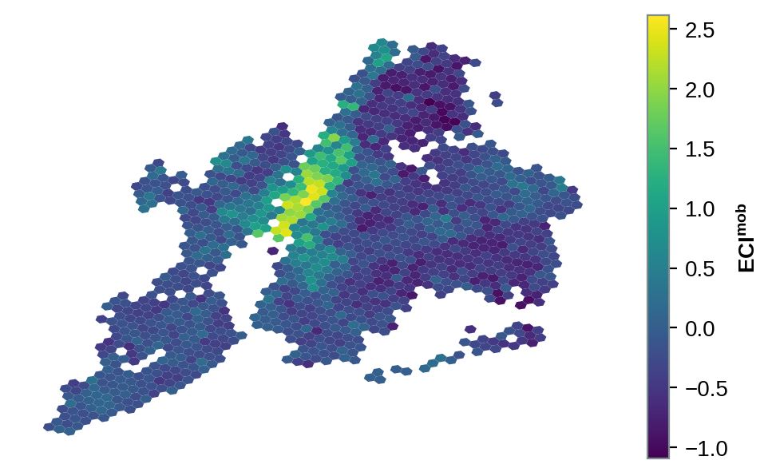
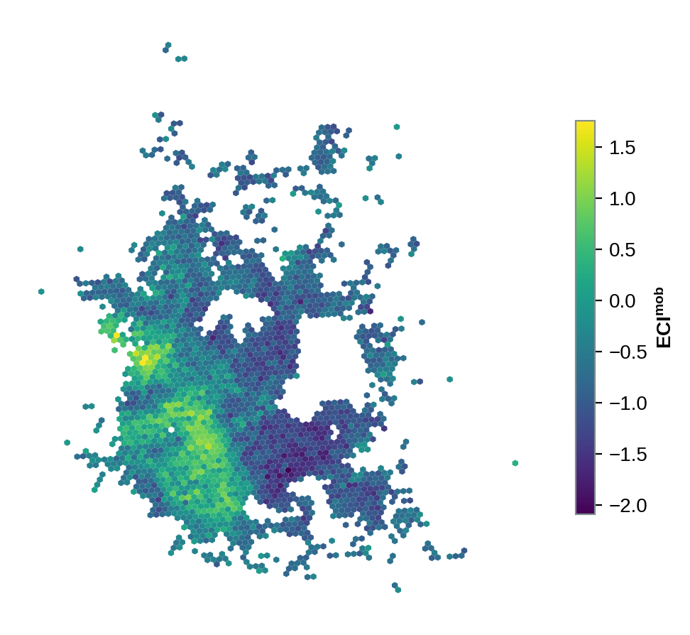
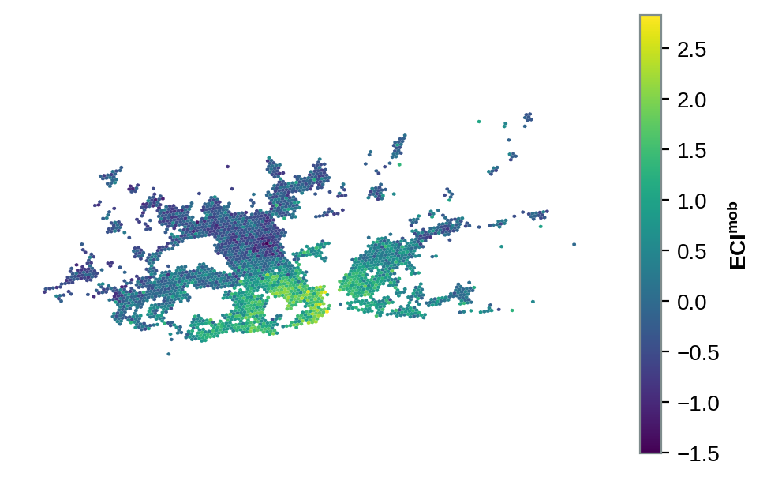
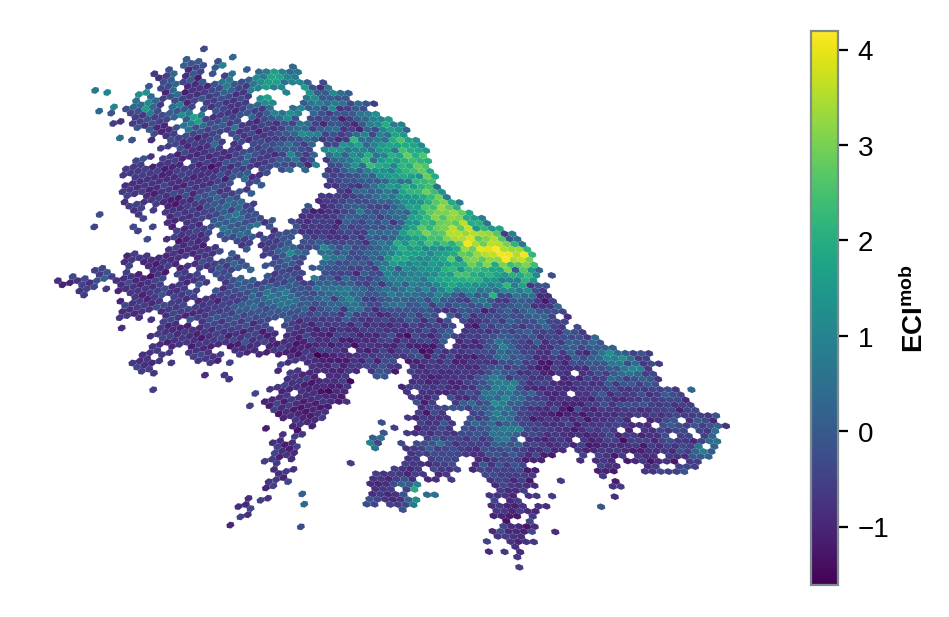

## Setup

The index is defined on work locations, which are H3 resolution-8 cells, so the map
geometry comes straight from the cell index and no boundary files are needed. Mapping the
values shows the spatial signature of complexity within each metro.

```{python}
import os
os.chdir("..")

from eci import all_locations
from figures import style, city_map

style()
eci = all_locations()
```

## Four cities

```{python}
for city, tag in [("nyc", "nyc"), ("mexico_city", "mexico_city"),
                  ("rio_de_janeiro", "rio"), ("buenos_aires", "buenos_aires")]:
    city_map(eci, city, f"map_{tag}")
```









Complexity concentrates in and around the central business core and thins toward the
edges, with secondary peaks at sub-centres. The pattern is monocentric in some metros and
polycentric in others, which is exactly the kind of within-city structure the index is
meant to capture.
