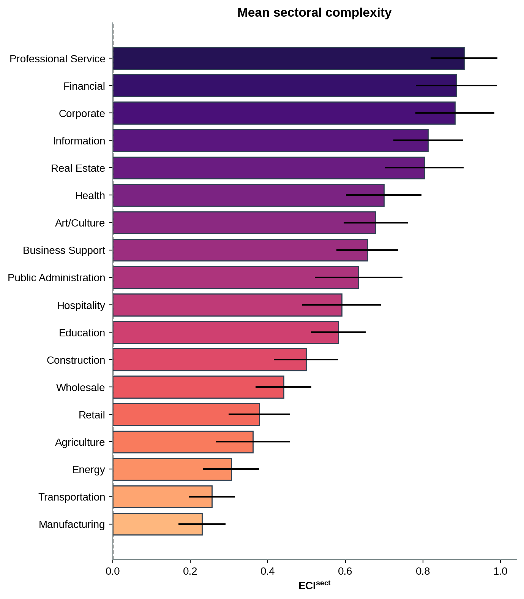

## Setup

Projecting complexity onto sectors gives each sector a within-city complexity, averaged
over the locations where it concentrates. Sectors that sit in complex locations score
high; sectors spread across the periphery score low. Comparing cities on their sector
profile shows how metros of similar overall complexity still differ in what they do.

```{python}
import os
os.chdir("..")

import pandas as pd

from data import load_sector_eci, load_rank_zscore, CITY_LABEL
from sectors import mean_sector_eci, sector_rank_matrix, city_profile
from figures import style, sector_bar, sector_heatmap, city_radars

style()

sector_eci = load_sector_eci()
rank_zscore = load_rank_zscore()
```

## Complexity by sector

```{python}
ms = mean_sector_eci(sector_eci)
sector_bar(ms, "sector_complexity")
ms.round(3)
```



Professional services, corporate and business support carry the most complexity; retail,
manufacturing and agriculture the least. The ordering matches the intuition that
knowledge-intensive work clusters in the most complex parts of a metro.

## Sector rankings within a country

```{python}
sector_heatmap(sector_rank_matrix(sector_eci, "MX"), "sector_ranking_mx", "Mexico")
```


## Comparing city profiles

```{python}
city_radars(rank_zscore, ["nyc", "mexico_city", "rio_de_janeiro", "buenos_aires"],
            "city_radars")
```


Cities with comparable mean complexity still specialise differently. Reading the profiles
side by side separates finance-heavy from industry-heavy from administration-heavy metros.
