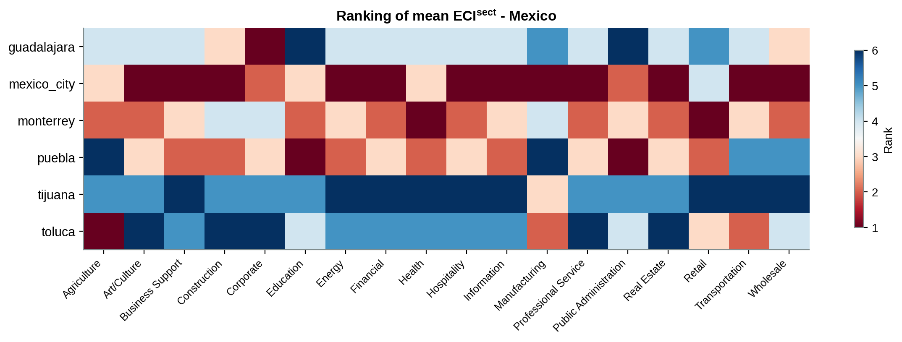
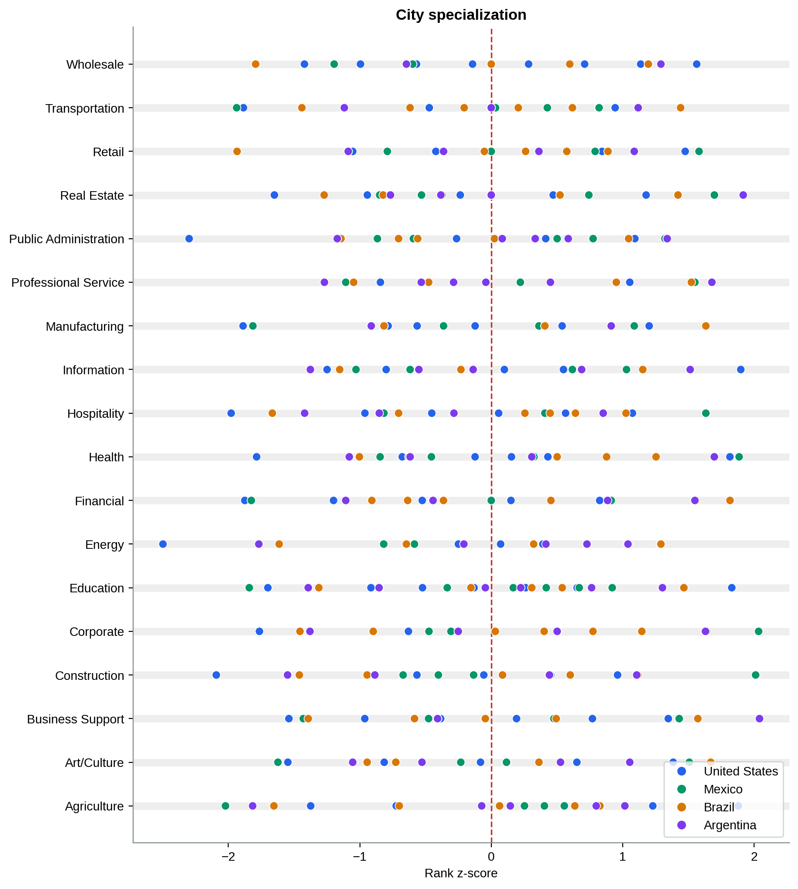

## Setup

Projecting complexity onto sectors gives each sector a within-city complexity, averaged
over the locations where it concentrates. Sectors that sit in complex locations score
high; sectors spread across the periphery score low. Comparing cities on their sector
profile shows how metros of similar overall complexity still differ in what they do.

```{python}
import os, sys
os.chdir("..")
sys.path.insert(0, "src")

import pandas as pd

from data import load_sector_eci, load_rank_zscore
from sectors import sector_rank_matrix
from figures import style, sector_heatmap, specialization_dotplot

style()

sector_eci = load_sector_eci()
rank_zscore = load_rank_zscore()
```

## Sector rankings within a country

```{python}
sector_heatmap(sector_rank_matrix(sector_eci, "MX"), "sector_ranking_mx", "Mexico")
```



Reading each city's row shows where its complexity sits: professional services, corporate
and business support rank high, retail and manufacturing low.

## Comparing city profiles


Cities with comparable mean complexity still specialise differently. Each profile is read
against the country mean and its one standard deviation band, which separates finance-heavy
from industry-heavy from administration-heavy metros.

## Where each sector concentrates

```{python}
specialization_dotplot(rank_zscore, "specialization_dotplot")
```



Laying every city out along each sector's axis shows which metros stand out in which
sectors, and that the standouts cut across countries.
